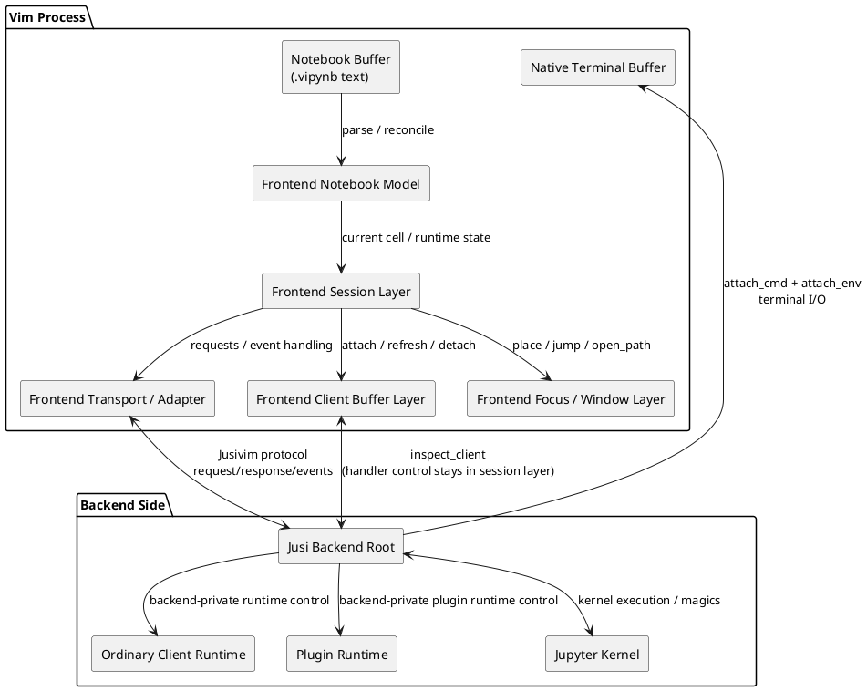
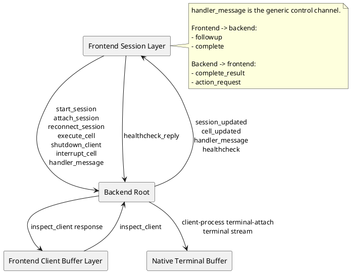
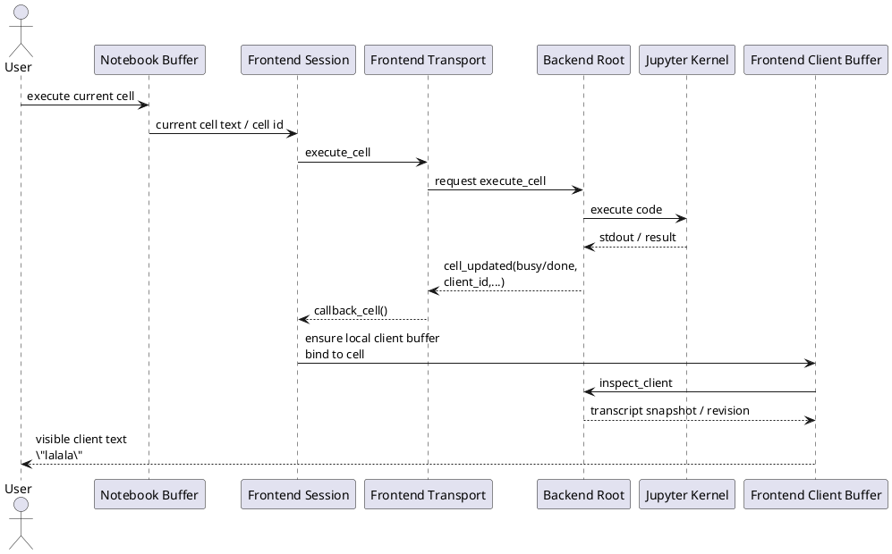
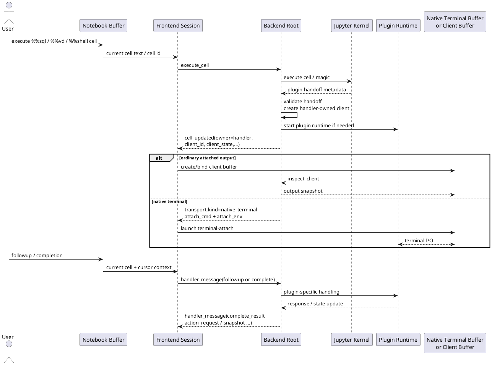
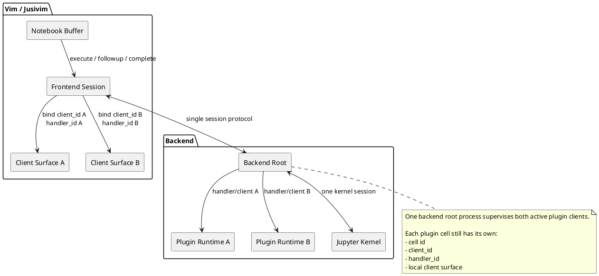

# Jusivim Runtime Flows

This file is a compact reference for the current runtime shape of Jusivim.

It focuses on:

- the main moving parts
- the links between them
- the protocol used on each link
- the current flow for ordinary execution and plugin-backed execution

The diagrams below use PlantUML.

## Component Overview

## Protocol Boundaries

## Use Case 1: Simple `print('lalala')`

### Notes

- No plugin runtime is involved.
- No native terminal handoff is involved.
- The visible client buffer is refreshed from `inspect_client`.

## Use Case 2: One Active Plugin

### Notes

- After execution starts, plugin identity is backend-owned.
- `handler_message` is the control channel around the plugin.
- Fullscreen interaction is on the native-terminal path, not through `handler_message`.

## Use Case 3: Two Active Plugins

### Notes

- The session is shared.
- The kernel is shared.
- Cell/client/handler identity is separate per active plugin cell.
- This is why two active plugins are now a normal case rather than a special-mode workaround.

## Glossary

- Notebook Buffer
  - The actual `.vipynb` text buffer in Vim.
  - Source of truth for notebook text and cell delimiters.

- Frontend Notebook Model
  - In-memory parsed notebook state.
  - Owns runtime-stable cell ids, cell coordinates, cell status, and notebook-local state.

- Frontend Session Layer
  - Owns `b:jusi_nb.session`.
  - Sends backend requests.
  - Applies backend events.
  - Routes plugin control messages.

- Frontend Transport / Adapter
  - Encodes and decodes the Jusivim/backend protocol.
  - Handles request/response/event dispatch.

- Frontend Client Buffer Layer
  - Manages local Vim buffers used as output/client views.
  - Refreshes ordinary client content through `inspect_client`.
  - Tracks local notebook/cell/client attachment metadata.

- Frontend Focus / Window Layer
  - Places client buffers.
  - Switches notebook <-> client focus.
  - Handles built-in editor actions like `open_path`.

- Native Terminal Buffer
  - A real Vim/Neovim terminal buffer created from backend-provided `attach_cmd` and `attach_env`.
  - Used for fullscreen interactive plugin clients.

- Backend Root
  - The authoritative process for session truth, client truth, and handler/plugin truth.
  - Talks to the frontend over the explicit protocol.
  - Talks to the kernel and manages backend-side runtimes.

- Ordinary Client Runtime
  - Backend-managed execution/output surface for a normal code cell.
  - Not a separate frontend protocol boundary.

- Plugin Runtime
  - Backend-managed runtime for plugin-specific interactive behavior.
  - May be attached through a native terminal buffer.

- Jupyter Kernel
  - Executes ordinary code cells.
  - Executes plugin-provided magics through kernel extensions.

- Handler Channel
  - Structured plugin control channel carried through `handler_message`.
  - Frontend -> backend:
    - `followup`
    - `complete`
  - Backend -> frontend:
    - `complete_result`
    - `action_request`

- `inspect_client`
  - Frontend pull-based snapshot request used to refresh ordinary attached client buffers.
  - Not the rendering transport for fullscreen native-terminal clients.

- `cell_updated`
  - Backend event describing current cell/client lifecycle state.
  - The backend remains authoritative for client identity and ownership.

- `session_updated`
  - Backend event describing session lifecycle state.

- `healthcheck`
  - Backend liveness event while connected.
  - Frontend responds with `healthcheck_reply` for the matching connected session only.
